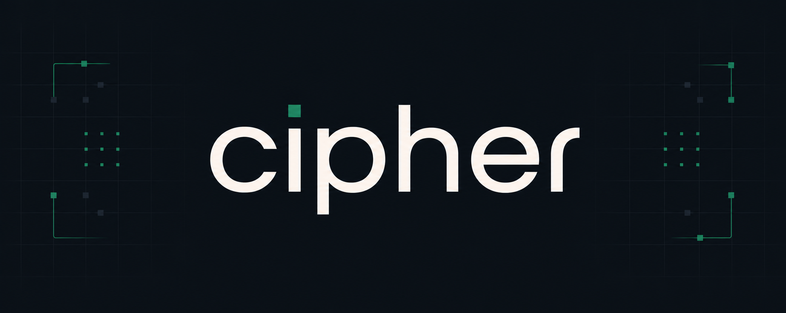

  

<h1 align="center">cipher</h1>

  an AP cybersecurity assessment platform for high school students.

---

## overview

cipher is built for a classroom AP cybersecurity course that needs AP-aligned practice scenarios, quizzes, psets, mock exams, and teacher review in one place.

students use it to complete assessment modules and track scores. the teacher uses it to create and review assessments, manage submissions, and check progress.

## features

- student accounts
- five AP cybersecurity modules
- quizzes and scoring
- case scenarios
- pset-style written responses
- mock exam practice
- attempt tracking
- teacher/admin review dashboard

## tech stack

- next.js
- tailwind css
- typescript
- fastapi
- python 3.12
- postgresql
- netbird

## status

assessment-only pivot is in progress.

completed:

- postgresql schema
- backend database connection
- backend health check
- authentication api
- frontend auth and navigation flow
- end-to-end smoke test
- week 2 test plan
- read-only course structure api
- unit/module/lesson pages
- unit 1 seed content
- admin course management dashboard
- admin create/edit/delete for units, modules, and lessons
- multiple-choice quiz models and api
- quiz attempts and scoring
- lesson completion tracking
- student progress dashboard
- admin quiz management tools
- assessment-only pivot docs
- five AP CED module seed structure
- student assessment browsing page

current focus:

- replace remaining lesson/course wording with assessment wording
- add AP-aligned case scenarios and psets
- add admin creation/review for assessment submissions
- prepare demo-ready assessment flow by july 31

module map:

1. introduction to security
2. securing spaces
3. securing networks
4. securing devices
5. securing applications and data
